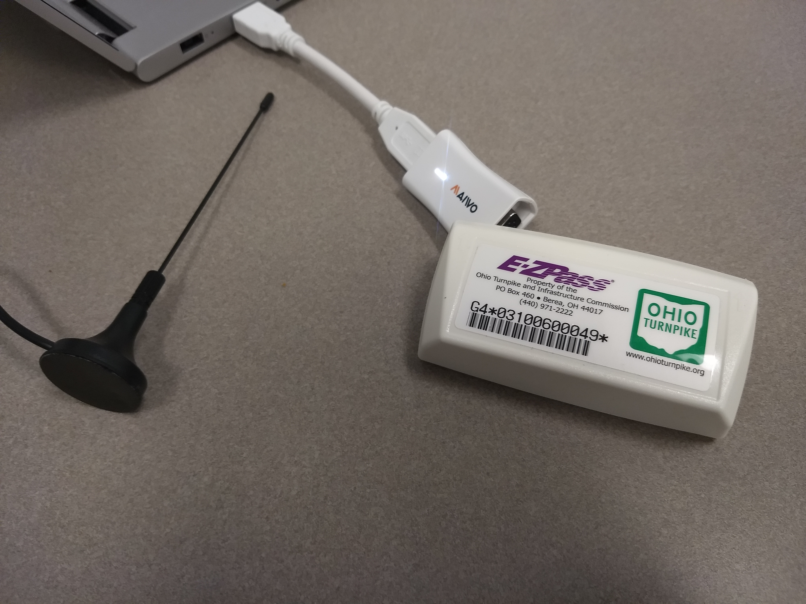
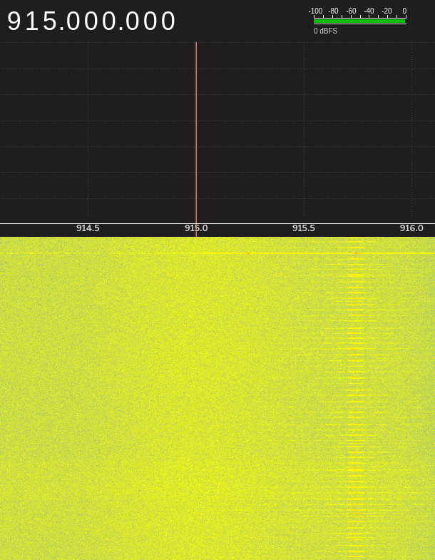
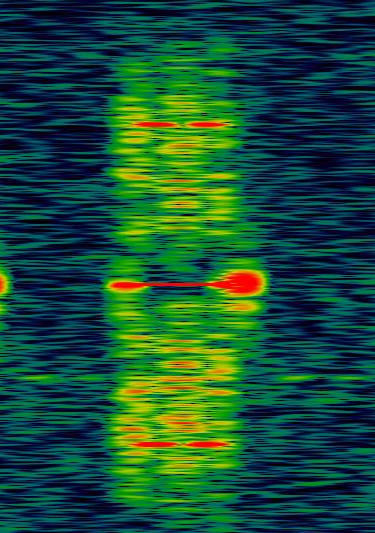

# ez-sniff : a software-defined radio (SDR) utility
Demodulate and dissect radio frequency (RF) packets from toll booth transponders in the E-ZPass network
See example recordings at https://zenodo.org/records/13372917.


## Disclaimer
* Radio frequency signals should be filtered before transmission to avoid interference with nearby devices.
* All provided demo E-ZPass packets were captured with explicit permission of the owner.
* Toll booth evasion is illegal, and E-ZPass has infrastructure in place to catch people who attempt to leverage this code to perform attacks.
* I don't take responsibility for anything you do with this code.


## Table of Contents
1. [Introduction](#introduction)
2. [Setup](#setup)
   - [Dependencies](#dependencies)
   - [Building](#building)
3. [Usage](#usage)
   - [Receiving and Analyzing](#receiving-and-analyzing)
   - [Transmitting and Cloning (For Research Purposes Only)](#transmitting-and-cloning-for-research-purposes-only)
   - [C++ Disection Script](#c-dissection-script)
4. [Permalinks](#permalinks)
5. [Licenses](#licenses)


## Introduction
E-ZPass is a toll collection network which mostly operates in the eastern half of the United States. E-ZPass, like many toll agencies, offers a fast lane service which relies on a small radio frequency (or RF) device on the windshield of each customer car. This RF device can be scanned at high speed to charge an account, rather than paying in cash at the toll booth. E-ZPass uses [Janus Interior Transponders from Kapsch TrafficCom,](https://www.kapsch.net/ktc/downloads/datasheets/in-vehicle/915/Kapsch-KTC-DS-JANUS_Interior.PDF?lang=en-US) which implements the Kapsch TDM protocol for its RF communications. Access to a PDF of the specificiation can be requested as a company or individual from [this registration page.](http://tdm.kapschtraffic.com/registration.asp)

The TDM protocol is unencrypted, and can be experimented with using some hardware for capturing and emitting the raw RF signals. A software-defined radio (or SDR) is the tool of choice for interacting with RF signals. While any SDR with a bandwidth greater than 1MHz should work for recording E-ZPass samples, the tools included in this repo were tested to work specfically with an RTL-SDR, which has the advantage of being very cheap (~$25 at [this link](https://www.rtl-sdr.com/buy-rtl-sdr-dvb-t-dongles/)). More background information about the original research and release of the RTL-SDR (which was adapted from a consumer over-the-air TV dongle) can be found at [this page.](https://www.rtl-sdr.com/about-rtl-sdr/)

However, the RTL-SDR is a receive-only (or RX) device and cannot transmit signals. This project includes tools so that another low-cost (~$20 at [this link](https://www.gearbest.com/cables-connectors/pp_1238337.html)) device known as the Osmo-FL2k (but sold under different hardware names) can be used to transmit (TX) signals and imitate an E-ZPass toll booth reader to interact with the E-ZPass transponders. Information about the device, as well as a download for the device driver, can be found on [the Osmocom wiki.](https://osmocom.org/projects/osmo-fl2k/wiki)

The Osmo-FL2k has been tested to properly output modulated data packets; however, signals from the device alone are too weak to prompt a response from the E-ZPass transponders. Chaining a [filter](https://www.tindie.com/products/gpio/915-mhz-ism-band-pass-filter-amateur-radio-rfid/) and [amplifier](https://usa.banggood.com/4_0W-30dB-915MHz-RF-Power-Amplifier-p-1167605.html?gmcCountry=US&currency=USD&cur_warehouse=CN) to the Osmo-FL2k output should be enough to read and write the transponders, though this currently has not been tested. Any SDR which comes with TX ability should work without needing these additional parts, though will likely be more expensive. Check out [this project](https://github.com/pvachon/zepassd) if you have a USRP.

This project began as part of the interview process for a summer internship (which graciously let me keep rights to the code). I continued the research to investigate transmitting when I heard of the Osmo-FL2k.

I gave a presentation on this research at BSides Columbus 2019. A video of the presentation and slides is accessible on [the Internet Archive.](https://archive.org/details/BSidesColumbus2019/BSidesCMH2019-303-E-ZHack-An-Update-on-SDR-and-Toll-Booth-Reverse-Engineering-Kyle-Westhaus.mp4)


## Setup
This program has been tested on Manjaro Linux with the 4.19 kernel and GNURadio 3.7.13.4.

The below image shows an Osmo-FL2k and the antenna of an RTL-SDR attached to a laptop near an E-ZPass transponder.




### Dependencies
This project makes use of other libraries including:
* [Daniel Bahr's single-header CRC++](https://github.com/d-bahr/CRCpp) (included in this repo)
* Boost::Multiprecision for uint256_t (not included in this repo)
Boost libraries can be obtained either from your system's package manager or according to their [Getting Started page.](https://www.boost.org/doc/libs/1_69_0/more/getting_started/unix-variants.html)
* The files in the grc directory rely on GNURadio Companion (GRC) (not included in this repo)
The GNURadio set of tools can likely be installed from your package manager, which is typically much simpler than building from source.


### Building
Begin by cloning the repo. Assuming you have the Boost header libraries properly installed, compiling should then be as simple as:
``` bash
> cd dissector/src
> g++ ./ezp-dissect.cpp -o ../bin/ezp-dissect.out
> cd ../../datagen
> g++ ./mult-byte-gen.cpp -o ../bin/mult-byte-gen.out
```


## Usage
This code serves as the software to reverse engineer and experiment with E-ZPass toll booth transponders in various ways. Uses include:
### Receiving and Analyzing
1. Use an SDR device to record raw RF samples on the appropriate frequency (usually 914.3-916.0MHz) while located near a transponder passing through a toll booth.
2. Adjust the "capture_freq", "xponder_freq", "reader_freq", "samp_rate", and "target_rate" variables in [grc/rtlsdr_both.grc](grc/rtlsdr_both.grc) for your specific use case.
3. Process the raw capture file with the adjusted GRC flowchart.
4. Analyze the processed file with the C++ dissection script to read transponder packet data.

This process was tested using captures from an RTL-SDR sampling at 2.4MHz and 3.2MHz, and a lab-grade SDR sampling at 10MHz.


### Transmitting and Cloning (For Research Purposes Only)
1. Use the C++ script in the datagen directory to add interrogation pulses and proper timing gaps to a GRC-output packet file from the above "Receiving and Analyzing" steps.
2. Modify the "File Source" and "File Sink" blocks in the grc/output_osmo.grc file for your specific use. The "samp_rate" and "offset_freq" variables can be modified to change the harmonic frequency at which the Osmo-FL2k will output, which is currently set to 915.75MHz (at the 7th harmonic: 7*140MHz - 64.2MHz - 0.05MHz drift).
3. Process a modified packet data file from Step 1 with the output_osmo GRC flowchart.
4. Transmit the produced raw RF sample file with a capable SDR device in order to trigger and overwrite the contents of an E-ZPass transponder. This program currently outputs 8-bit signed samples for use with an Osmo-FL2k device. Ouput with the Osmo-FL2k works as follows:
``` bash
> fl2k_file -s 140e6 gendata-mod.bin
```

The image below shows E-ZPass transponder trigger pulses successfully being output by the Osmo-FL2k at 915.75MHz, as seen in the waterfall view of GQRX while recording with the RTL-SDR.



Next is a window from the spectrum analysis program Inspectrum showing a comparison of a packet output from a real E-ZPass reader and from an Osmo-FL2k after using the utilities in this repo. Their similarity shows that the modulation is correctly imitated. However, these two samples were recorded at different RTL-SDR gain values; when recorded with the same settings, the Osmo-FL2k output is barely visible, confirming the need for an amp for successful cloning.

 


### C++ Dissection Script
Command-line usage for the C++ processing and analysis script is as follows:
```

*** Usage: ***
ezp-dissect [-i "input file name"] [-g] [--grc-file] [-s] [--short-file] [-o "output file name"]

File operations:
	-i "input file name"	Input packet file to read and analyze
	-o "output file name"	Output packet file to craft and write
	** Note: valid options include -i only (read and display), -o only (craft, display, and write),
	**     or both -i and -o (read GRC file, output as short file)
	** If both -i and -o are specified, --grc-file is assumed and should not be specified (nor -g)

Input file formatting:
	-g, --grc-file		Read in a file output by a GnuRadio flowchart.
				** Expects unpacked (one bit per byte), Manchester encoded, and non-cut data
	-s, --short-file	Reads in a file containing only the exact packet
				** Expects a 256bit MSB-first file
				** Test packets output by this program conform to this option

*** Examples: ***
	ezp-dissect -i reader_cap.ezp --short-file
	ezp-dissect -i xponder_ohioturnpike.grc.bytes -g
	ezp-dissect -o reader_buzzHMI.ezp
	ezp-dissect -i xponder_nonconformant.grc.bytes -o xponder-nonconformant.ezp


```


## Permalinks
Links in the above text were live at the time I originally published this repository. In the event that link rot should occur, I have verified that the following links point to the intended content. The links make use of the Internet Archive's Wayback Machine.

[Janus Interior Transponders from Kapsch TrafficCom](https://web.archive.org/web/20200504001647/https://www.kapsch.net/ktc/downloads/datasheets/in-vehicle/915/Kapsch-KTC-DS-JANUS_Interior.PDF?lang=en-US)

[TDM Protocol Registration](https://web.archive.org/web/20191102102857/http://tdm.kapschtraffic.com/registration.asp)

[RTL-SDR Purchase](https://web.archive.org/web/20200426174714/https://www.rtl-sdr.com/buy-rtl-sdr-dvb-t-dongles/)

[RTL-SDR Background](https://web.archive.org/web/20200427085759/https://www.rtl-sdr.com/about-rtl-sdr/)

[Osmo-FL2k Purchase](https://web.archive.org/web/20200425144323/https://www.gearbest.com/cables-connectors/pp_1238337.html)

[Osmocom FL2k Wiki](https://web.archive.org/web/20200414204524/https://osmocom.org/projects/osmo-fl2k/wiki)

[915MHz Filter](https://web.archive.org/web/20190409235215/https://www.tindie.com/products/gpio/915-mhz-ism-band-pass-filter-amateur-radio-rfid/)

[915MHz Amplifier](https://web.archive.org/web/20200504004035/https://usa.banggood.com/4_0W-30dB-915MHz-RF-Power-Amplifier-p-1167605.html?gmcCountry=US&currency=USD&cur_warehouse=CN)

[Code for USRP Device](https://web.archive.org/web/20200504004832/https://github.com/pvachon/zepassd)

[Daniel Bahr's single-header CRC++](https://web.archive.org/web/20200504005142/https://github.com/d-bahr/CRCpp)

[Boost Library Getting Started Page](https://web.archive.org/web/20200504005324/https://www.boost.org/doc/libs/1_69_0/more/getting_started/unix-variants.html)


## Licenses
This code is free to use and available under the GPLv3 license. Full license texts for both this project and associated libraries are located in the LICENSES directory.
